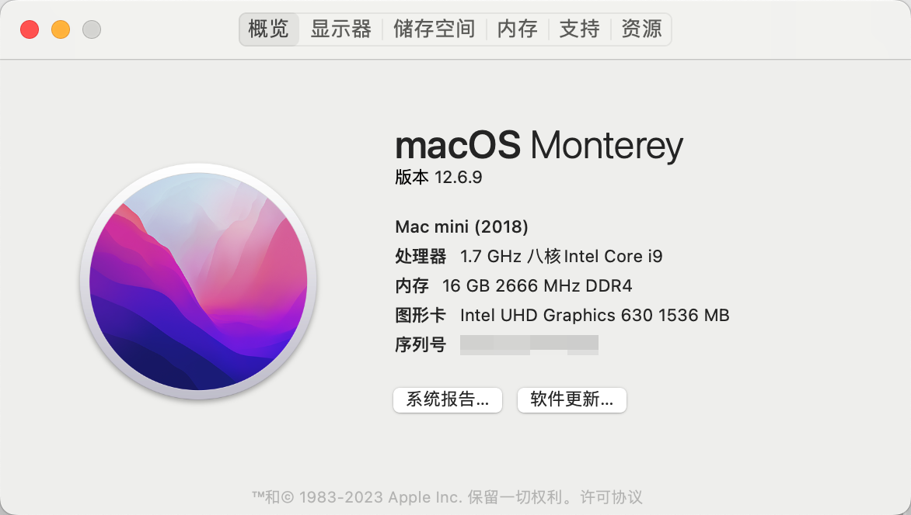
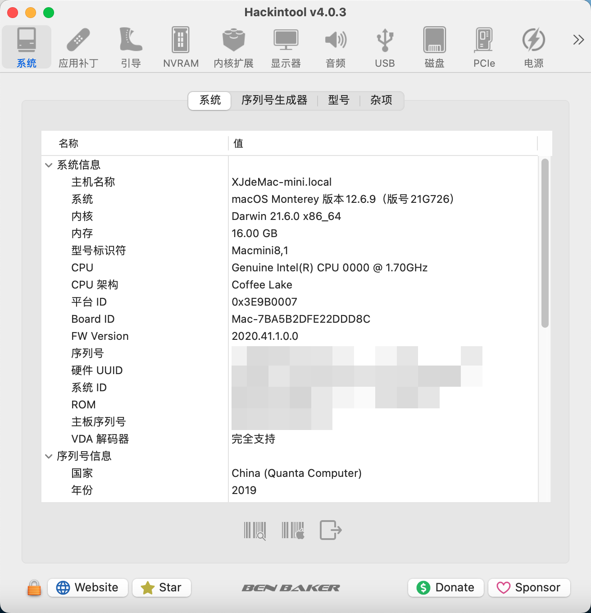
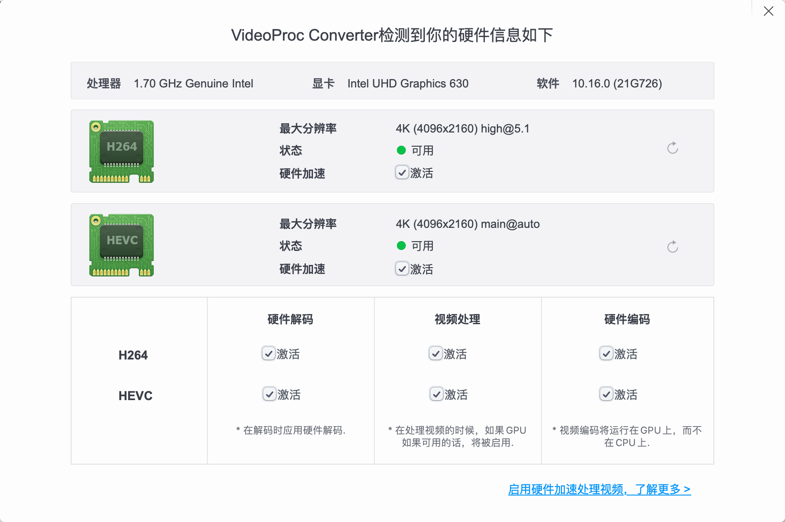
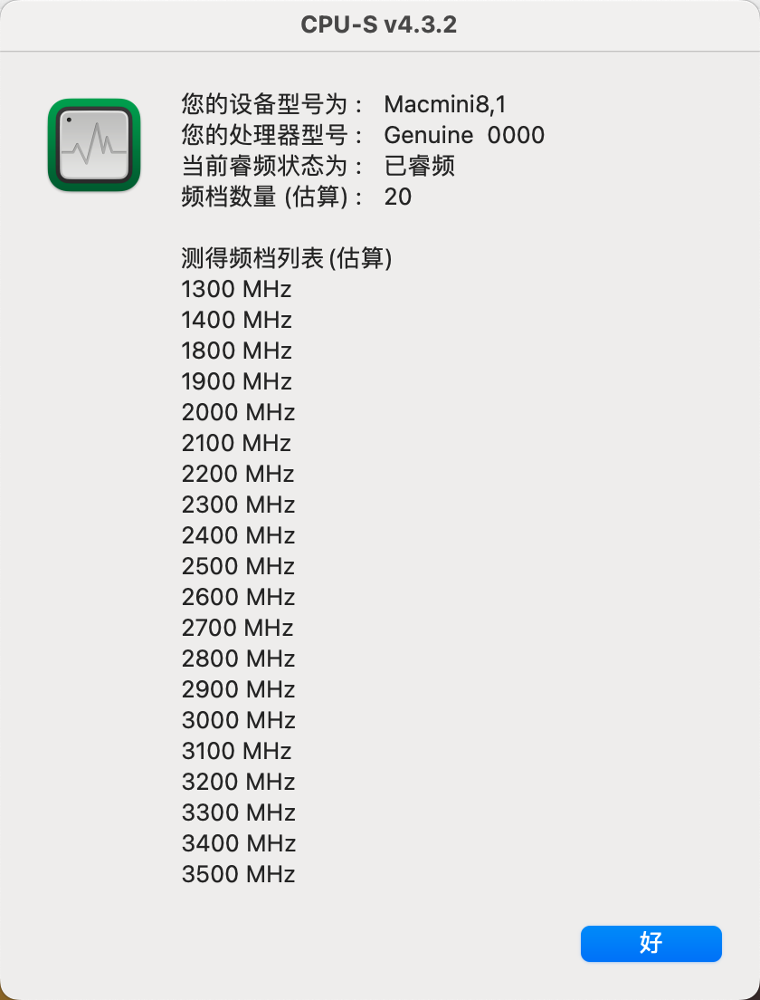
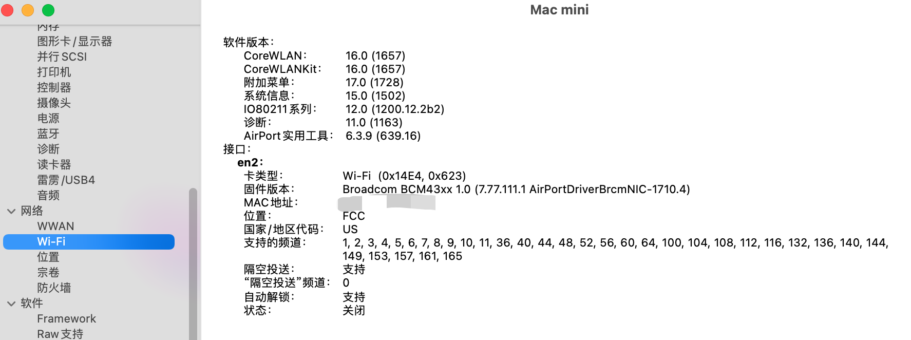
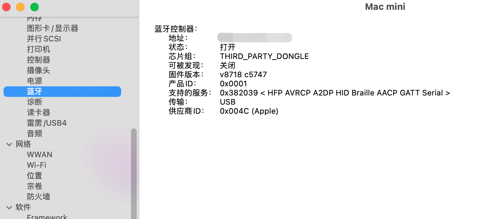
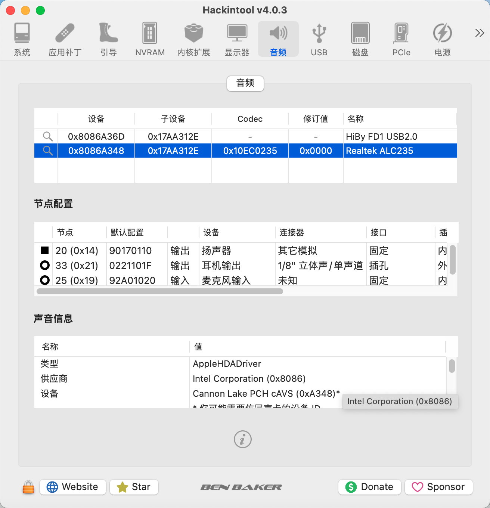

# Hackintosh EFI for NEC8 / M720q

All the software used are up-to-date until 2024/5/1

This EFI can be used in MacOS 11, 12, 13 and 14

**TO DO**

- Use [GenSMBIOS](https://github.com/corpnewt/GenSMBIOS) to generate your own SMBIOS
  - Choose type: `Macmini8,1`
  - Get `Serial`, `Board Serial`, `SmUUID`, `ROM` and copy to `config.plist/Generic`
  - More Info see [Desktop Coffee Lake | OpenCore Install Guide (dortania.github.io)](https://dortania.github.io/OpenCore-Install-Guide/config.plist/coffee-lake.html#platforminfo)

**BIOS Setting**

- Update your BIOS to the latest version
  - [NEC BIOS](https://support.nec-lavie.jp/driver/detail?module_no=11713) (2024.6.4 latest: `M1UKT73A`)
  - [Lenovo BIOS](https://think.lenovo.com.cn/support/driver/driverdetail.aspx?DEditid=126177&driverID=undefined&treeid=undefined) (2024.6.4 latest: `M1UKT75A`)

- Ensure the microcode of CPU is supported by BIOS (**especially if use 9th Intel**)
  - For example, the microcode of QQC0 is `906EC`
  - Latest `M1UKT73A` supports `906EC` 
  - Original `M1UKT1BA` doesn’t support `906EC`

- **!!!Highly-risk operation!!!** Ensure unlock `CFG Lock` through modifying BIOS
  - If skip, set `AppleCpuPmCfgLock` and `AppleXcpmCfgLock` to **`True`**
- Choose **`Auto`** in `BIOS/Video Setup/Select Active Video` to use `dGPU`

**Software**

| Core Components | Version                  |
| --------------- | ------------------------ |
| Opencore        | 0.99                     |
| MacOS           | Monterey 12.6.9 (21G726) |

**Hardware**

| Components     | Used                                                 |
| -------------- | ---------------------------------------------------- |
| Model          | NEC8 (ThinkCentre M720 Tiny)                         |
| CPU            | QQC0 (I9 9900T ES, coffee lake, 35w)                 |
| Graphics Card  | Intel UHD Graphics 630 / Quadro K420 (Kepler, GK107) |
| RAM            | 8Gx1 Hynix DDR4 2400 (later update to 8Gx2)          |
| ROM            | KIOXIA RC10 512G                                     |
| WIFI/Bluetooth | BCM94352Z (DW1560 Lenovo)                            |
| Audio          | Realtek ALC235                                       |
| Ethernet       | Intel I219-V                                         |

**Opencore Kexts**

| Name             | Version |
| ---------------- | ------- |
| WhateverGreen    | 1.6.7   |
| Lilu             | 1.6.8   |
| USBToolBox       | 1.1.1   |
| IntelMausi       | 1.0.8   |
| AppleALC         | 1.9.0   |
| VirtualSMC       | 1.3.2   |
| BrcmPatchRAM     | 2.6.8   |
| NVMeFix          | 1.1.1   |
| AirportBrcmFixup | 2.1.8   |

**Implement Functions**

- Create SSDTs for M720q
- USB mapping
- Patching HDMI of `iGPU`
- Fixing Audio
- Fixing DRM
- Fixing iServices
- Fixing Power Management
- Fixing Sleep

**Notes**

- `AppleCpuPmCfgLock` and `AppleXcpmCfgLock` are **`False`**
- Choose **`Macmini8,1`** as `PlatformInform` for lower power usage
- Use **`alcid=17`** to drive the Realtek ALC235
- Use **`07009B3E`** for `AAPL,ig-platform-id` and **`Shiki=40`** to fix the DRM
- Use **`4101`** for `ProcessorType` to show Intel Core i9
- Quadro K420 is weaker than UHD630
  - Only supports Metal 1
  - Highest supported in Big Sur 11.6.x
  - Use Geforce Kepler patcher to patch in Monterey

- UHD630 supports Metal 1, 2 and even 3
- Steps to drive DW1560
  - Add **`brcmfxbeta`** in `boot-args`

  - **Enable** `BlueToolFixup.kext`
    - Set `MinKernel` to **`21.00.00`**

  - **Enable** `BrcmFirmwareData.kext`
  - **Enable** `BrcmPatchRAM3.kext`
    - Set `MinKernel` to **`19.00.00`**

  - **Enable** `AirportBrcmFixup.kext`
    - **Disable** `AirPortBrcm4360_Injector.kext`
    - **Enable** `AirPortBrcmNIC_Injector.kext`

  - **Disable** `BrcmBluetoothInjector.kext`

**Screenshots**

